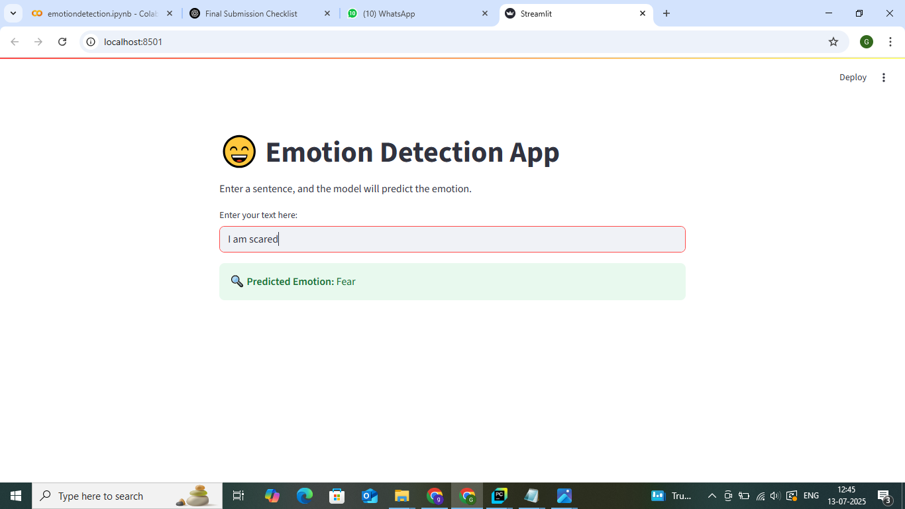

# 🧠 Emotion Detection from Text using BERT (TensorFlow)

## 🔍 Problem Statement

The goal of this project is to build an **Emotion Detection** system that can classify a piece of text (e.g., a tweet, review, or message) into predefined emotion categories such as:

> 😢 Sadness, 😄 Joy, ❤️ Love, 😠 Anger, 😨 Fear, 😲 Surprise

This project combines **Natural Language Processing (NLP)** and **Deep Learning** using a fine-tuned **DistilBERT** model.

---

## 📌 Project Workflow

### 1️⃣ Problem Understanding
- 6 Emotion classes:
  - `sadness`, `joy`, `love`, `anger`, `fear`, `surprise`
- Dataset: Cleaned and labeled emotion dataset
- Goal: Build a BERT-based classifier with a working UI

### 2️⃣ Data Collection & Preprocessing
- Dataset located in `data/train.csv` and `data/test.csv`
- Preprocessing:
  - Lowercasing
  - Tokenization
  - Label encoding for training
- Hardcoded `label_map` used in inference

### 3️⃣ Model Building
- Model: `TFDistilBertForSequenceClassification` (HuggingFace)
- Training done using TensorFlow backend
- Saved with `.save_pretrained()` to `bert_emotion_model/`

### 4️⃣ Evaluation
- Metrics:
  - Accuracy
  - F1-score (macro average)
  - Confusion matrix (optional)

### 5️⃣ Inference
- Prediction function in `inference.py`
- Uses:
  - `TFDistilBertForSequenceClassification`
  - `DistilBertTokenizer`
  - Manual `label_map` dictionary to map predicted index to emotion

### 6️⃣ UI (Streamlit)
- Found in `ui/app.py`
- Takes user text input and returns predicted emotion
- Run it with:
  ```bash
  python -m streamlit run ui/app.py

## 🎥 Demo Screenshot

Here’s a quick view of the working emotion detection app:



# Authers:
Jeetu Kumar,
Gokul N Ram,
Hardhik Trivedi.


